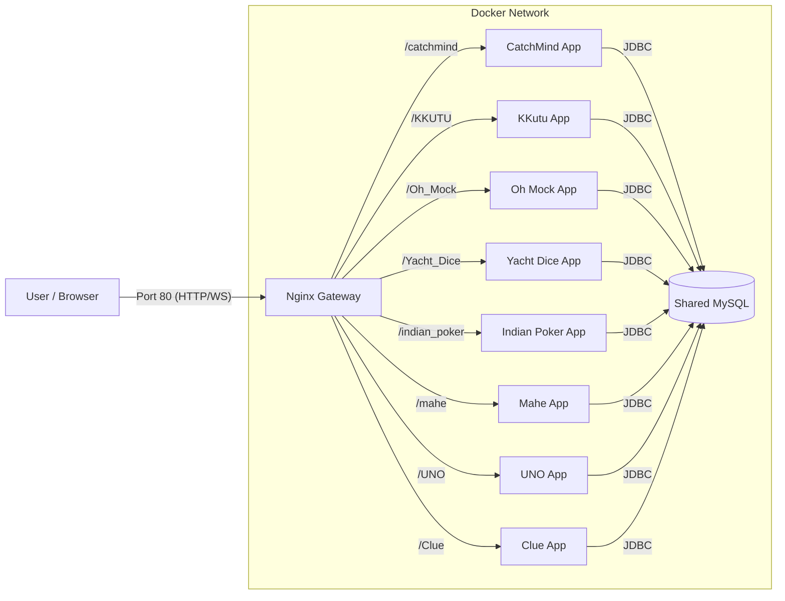

# 🎮 Web Mini-Game Hub (Multiplayer)

> **실시간 웹소켓 기반의 멀티플레이어 게임 플랫폼** > 캐치마인드, 끄투, 오목 등 다양한 미니게임을 하나의 허브에서 즐길 수 있습니다.


## 📋 프로젝트 소개

이 프로젝트는 **MSA(Microservices Architecture) 지향적 구조**로 설계된 웹 게임 플랫폼입니다.  
Nginx를 리버스 프록시(Gateway)로 사용하여 트래픽을 라우팅하며, 각 게임은 독립적인 Spring Boot 컨테이너에서 동작합니다.

### 🕹️ 포함된 게임
1.  **🎨 캐치마인드 (CatchMind)**: 출제자가 제시어를 그리면 다른 플레이어들이 실시간으로 맞추는 게임.
2.  **🗣️ 끄투 (KKutu)**: 끝말잇기 규칙을 기반으로, 봇 또는 다른 플레이어와 대결하는 게임.
3.  **⚪⚫ 오목 (Oh! Mock)**: 1대1로 즐기는 실시간 이미지 오목 게임.
4.  **🎲 야추 다이스 (Yacht Dice)**: 주사위를 굴려 족보를 완성하고 점수를 겨루는 보드게임.
5.  **🃏 인디언 포커 (Indian Poker)**: 상대방의 패를 추리하며 베팅하는 심리 카드 게임.
6.  **🐢 마헤 (Mahe)**: 주사위를 굴려 거북이를 이동시키는 레이싱 보드게임.
7.  **🃏 우노 (UNO)**: 색깔과 숫자를 맞추며 카드를 털어내는 카드 게임.
8.  **🕵️ 클루 (Clue)**: 단서를 모아 범인, 흉기, 장소를 추리하는 보드게임.

---

## 🛠️ 기술 스택 (Tech Stack)

### **Frontend**
* **Core**: HTML5, CSS3, Vanilla JavaScript (ES6+)
* **Communication**: WebSocket (SockJS, STOMP)
* **Graphics**: HTML5 Canvas API (드로잉 구현), `canvas-confetti` (이펙트)
* **Design**: Responsive UI, Dark Mode Support

### **Backend**
* **Framework**: Java 17, Spring Boot 3.x, Kotlin (Gradle KTS)
* **Database**: MySQL 8.0, JPA (Hibernate)
* **Real-time**: Spring WebSocket (STOMP Broker)

### **Infrastructure**
* **Container**: Docker, Docker Compose
* **Web Server**: Nginx (Reverse Proxy, Static File Serving)

---

## 🏗️ 시스템 아키텍처 (Architecture)


* **Nginx**: 메인 허브 UI 제공 및 각 게임 경로(`/catchmind`, `/KKUTU`, `/Oh_Mock` 등)에 따른 리버스 프록시 역할. 웹소켓(Upgrade 헤더) 처리가 구성되어 있습니다.
* **Spring Boot Apps**: 각 게임의 비즈니스 로직, 소켓 통신, 게임 룸 상태 관리를 담당합니다.
* **MySQL**: `kkutu_db`, `catchmind_db`, `oh_mock_db` 등 스키마를 통해 데이터를 분리하여 저장합니다.

---

## ✨ 주요 기능 (Key Features)

### 1. 공통 기능
* **게임 허브**: 직관적인 메인 화면에서 모든 게임의 서버 상태를 확인하고 접속 가능.
* **다크 모드**: 눈이 편안한 테마 전환 기능.
* **반응형 웹**: 모바일과 데스크톱 환경 지원.

### 2. 게임별 특징
* **캐치마인드**: Canvas API 좌표 동기화, 실시간 정답 판독 및 랭킹 시스템.
* **끄투**: 방대한 단어 DB 기반 검증, 봇 대전 모드, 두음법칙 지원.
* **오목**: 실시간 착수 동기화 및 승패 판정.
* **그 외**: 야추 다이스, 인디언 포커, 마헤 등 다양한 보드게임 룰 구현.

---

## 🚀 실행 방법 (Getting Started)

이 프로젝트는 **Docker Compose**를 통해 원터치로 실행할 수 있습니다.

### 사전 요구사항
* Docker & Docker Compose가 설치되어 있어야 합니다.

### 설치 및 실행

**1. 프로젝트 클론**
```bash
git clone [https://github.com/username/game-hub.git](https://github.com/username/game-hub.git)
cd game-hub
```
**2. 컨테이너 빌드 및 실행**
```bash
docker compose up -d --build
```
최초 실행 시 MySQL 초기화(init.sql, korean_kr.sql)로 인해 시간이 소요될 수 있습니다.

**3. 접속**

`브라우저 주소창에 http://localhost 입력.`

**🛑 실행 종료**
```Bash
docker compose down
```
`(데이터까지 초기화하려면 docker compose down -v)`

### 📂 프로젝트 구조 (Directory Structure)
```
.
├── docker-compose.yml       # 컨테이너 오케스트레이션 설정
├── settings.gradle.kts      # 멀티 모듈 설정
├── db/                      # DB 초기화 스크립트
│   └── init.sql             # DB 스키마 생성
├── nginx/                   # Nginx 설정 및 정적 파일
│   ├── nginx.conf           # 라우팅 및 웹소켓 설정
│   └── html/                # 메인 허브 화면 (index.html)
└── modules/                 # 각 게임 백엔드 프로젝트 (Submodules)
    ├── catchMind/           # 캐치마인드
    ├── KKUTU/               # 끄투 (korean_kr.sql 포함)
    ├── Oh_Mock/             # 오목
    ├── Yacht_Dice/          # 야추 다이스
    ├── indian_poker/        # 인디언 포커
    ├── mahe/                # 마헤
    ├── UNO/                 # 우노
    └── Clue/                # 클루
```

### 🐛 트러블슈팅 (Troubleshooting)
* Q. **끄투 봇이 시작하자마자 죽어요.**
  * A. **DB에 단어 데이터가 없어서 그렇습니다. `docker compose down -v`로 볼륨을 초기화한 후 다시 실행하면 korean_kr.sql이 로드되어 해결됩니다.**

* Q. **웹소켓 연결이 안 돼요 (404 Error).**
  * A. **Nginx 설정에서 Upgrade 및 Connection 헤더 설정이 올바른지 확인해야 합니다. 현재 프로젝트에는 이미 적용되어 있습니다.**

---
### DEMO

https://github.com/user-attachments/assets/c8341fa1-be1b-40a2-907e-37256c753e44

---

👤 Author
Yeedochi - Main Developer

License: MIT
